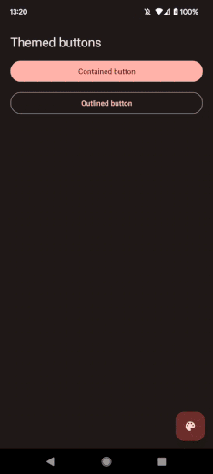

# 🎨 expo-material3-theme

This [expo module](https://docs.expo.dev/modules/overview/) allows you retrieve the [material3 dynamic theme](https://developer.android.com/develop/ui/views/theming/dynamic-colors) from Android 12+ devices, so that you can use it in your expo (or bare react-native) app.

For devices not compatible (iOS or older Android versions) a fallback theme is returned.

## ✨ Features

- Retrieve material3 dynamic theme from Android 12+ devices (or a fallback theme if device is not compatible)
- Generate material3 theme based on a source color (using [`@material/material-color-utilities`](https://github.com/material-foundation/material-color-utilities/tree/main/typescript))
- Material3 theme compatible with [`react-native-paper`](https://callstack.github.io/react-native-paper/)

<br>



## Installation

### Installation in managed Expo projects

```
expo install expo-material3-theme
```

### Installation in bare React Native projects

For bare React Native projects, you must ensure that you have [installed and configured the `expo` package](https://docs.expo.dev/bare/installing-expo-modules/) before continuing.

```sh
npm i --save expo-material3-theme && npx pod-install
# or
yarn add expo-material3-theme && npx pod-install
# or
pnpm add expo-material3-theme && npx pod-install
```

## Usage

### Retrieve theme

A basic usage would be to retrieve the material3 theme from user device (or a fallback theme if not supported) by using `useMaterial3Theme` hook:

```tsx
import { useMaterial3Theme } from 'expo-material3-theme';
import { useColorScheme, View, Button } from 'react-native';

function App() {
  const colorScheme = useColorScheme();
  // If the device does not support material3, it will return a theme based on the fallback source color (optional, default to #6750A4)
  const { theme } = useMaterial3Theme({ fallbackSourceColor: '#3E8260' });

  return (
    <View style={{ backgroundColor: theme[colorScheme].background }}>
      <Button color={theme[colorScheme].primary}>Themed button</Button>
    </View>
  );
}
```

### Change theme

You may also want to update the theme by generating a new one, or go back to the default theme (to let users personalize your app for example). You can do it with `useMaterial3Theme` hook:

```tsx
import { useMaterial3Theme } from 'expo-material3-theme';
import { useColorScheme, View, Button } from 'react-native';

function App() {
  const colorScheme = useColorScheme();
  const { theme, updateTheme, resetTheme } = useMaterial3Theme();

  return (
    <View style={{ backgroundColor: theme[colorScheme].background }}>
      {/* Update theme by generating a new one based on #3E8260 color */}
      <Button onPress={() => updateTheme('#3E8260')}>Update theme</Button>
      {/* Reset theme to default (system or fallback) */}
      <Button onPress={() => resetTheme()}>Reset theme</Button>
    </View>
  );
}
```

> ℹ️ `updateTheme()` and `resetTheme()` will change the theme returned by `useMaterial3Theme()`, it will not change theme at system level

### Usage with `react-native-paper`

`expo-material3-theme` provides a theme compatible with `react-native-paper`, so you can combine both libraries easily:

```tsx
import { useMaterial3Theme } from 'expo-material3-theme';
import { useMemo } from 'react';
import { useColorScheme } from 'react-native';
import { Button, MD3DarkTheme, MD3LightTheme, Provider as PaperProvider } from 'react-native-paper';

function App() {
  const colorScheme = useColorScheme();
  const { theme } = useMaterial3Theme();

  const paperTheme = useMemo(
    () =>
      colorScheme === 'dark' ? { ...MD3DarkTheme, colors: theme.dark } : { ...MD3LightTheme, colors: theme.light },
    [colorScheme, theme]
  );

  return (
    <PaperProvider theme={paperTheme}>
      <Button>Themed react native paper button</Button>
    </PaperProvider>
  );
}
```

## Example

You can see an example app in the [`example`](./example/) folder.

### Android example

Extract [zip file](docs/example-apps.zip), and install `expo-material3-theme-example-android.apk` on your device.

### iOS example

This is a file for iOS simulator. Extract [zip file](docs/example-apps.zip), and drag and drop `expo-material3-theme-example-ios` into your emulator.

## [API Reference](docs/API.md)

- [`useMaterial3Theme`](docs/API.md#usematerial3theme)
- [`getMaterial3Theme`](docs/API.md#getmaterial3theme)
- [`createMaterial3Theme`](docs/API.md#creatematerial3theme)

## ⚠️ Activity recreation

When material3 dynamic theme is changed on Android 12+ devices, it is a configuration change and the system will recreate an Activity.

This configuration change can't be disable: "Some configuration changes always cause the activity to restart. You can't disable them. For example, you can't disable the dynamic colors change introduced in API 32" (cf official [doc](https://developer.android.com/guide/topics/resources/runtime-changes#restrict-activity)).

So be aware that when users change their theme then go back to your app, all local state may be lost (and may cause some flickering) if your don't handle it.

## License

This project is released under the [MIT License](https://github.com/pchmn/firebase-cli-github-action/blob/main/license).
